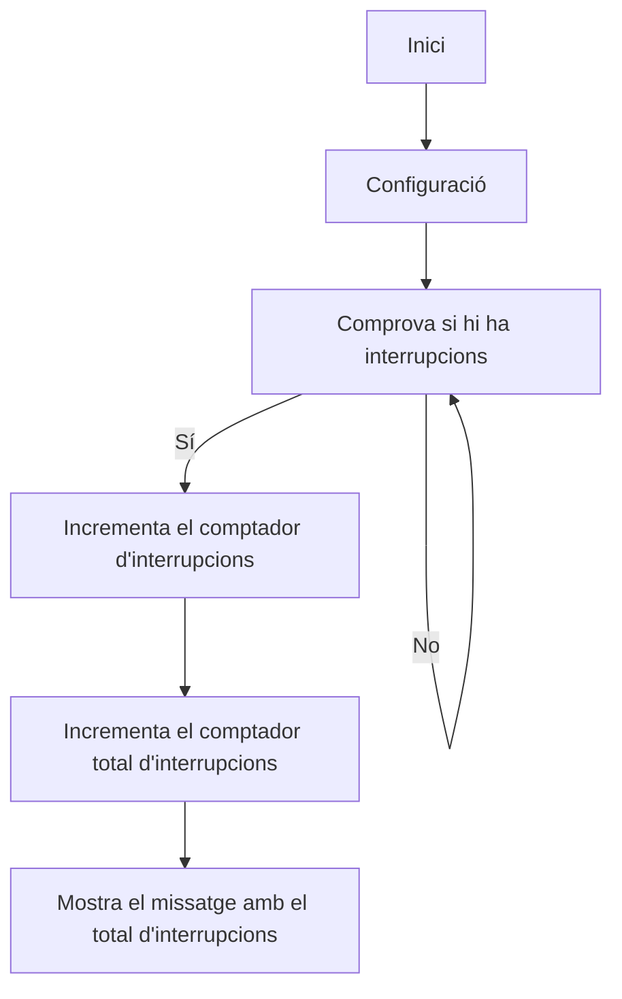

# Practica_2_Interrupcions
**Alumne:** Bernat Rubiol

## Objectiu

El objetivo de la practica es comprender el funcionamiento de las interrupciones.

Para lo cual realizaremos una practica  donde controlaremos  2 leds  de una forma periódica  y una entrada ; de forma que el uso de la entrada provoque un cambio de frecuencia de las oscilaciones  pero solo en un led.

## Codi
```cpp
struct Button {
  const uint8_t PIN;
  uint32_t numberKeyPresses;
  bool pressed;
};

Button button1 = {18, 0, false};

void IRAM_ATTR isr() {
  button1.numberKeyPresses += 1;
  button1.pressed = true;
}

void setup() {
  Serial.begin(115200);
  pinMode(button1.PIN, INPUT_PULLUP);
  attachInterrupt(button1.PIN, isr, FALLING);
}

void loop() {
  if (button1.pressed) {
      Serial.printf("Button 1 has been pressed %u times\n", button1.numberKeyPresses);
      button1.pressed = false;
  }

  //Detach Interrupt after 1 Minute
  static uint32_t lastMillis = 0;
  if (millis() - lastMillis > 60000) {
    lastMillis = millis();
    detachInterrupt(button1.PIN);
     Serial.println("Interrupt Detached!");
  }
}
```


## Informe
  realitzar l'informe de funcionament així com les sortides que s'obtenen a través de la impressió sèrie

En aquesta pràctica hem simulat un botó usant dos cables, que en entrar en contacte activen una interrupció al microcontrolador. L'objectiu era comptar el nombre de vegades que es crea aquest contacte entre els dos cables (GRD i PIN 18).

Quan els dos cables (que representen el botó) entren en contacte, es tanca un circuit, permetent que flueixi el corrent a través del PIN definit (en el nostre cas el 18) i terra. Quan això passa, el comptador de pulsacions s'incrementa un valor que registra el nombre total de vegades que s'ha produït el contacte entre els cables. Pel port sèrie s'imprimeix el nombre total de pulsacions de la manera següent:

### Resultat al terminal
    Button 1 has been pressed 1 times
    Button 1 has been pressed 2 times
    Button 1 has been pressed 3 times 
    ...
    Button 1 has been pressed N times


Passat un minut (temps modificable a l'expressió 'if (millis() - lastMillis > 60000) {') es desactiva la interrupció i surt pel port sèrie:
    
    Interrupt Detached!

Si en comptes de tenir 'if (millis() - lastMillis > 60000) {' tinguéssim 'if (millis() - lastMillis > 30000) {' la interrupció es desactiva passats 30 segons, i si tinguéssim 'if (millis() - lastMillis > 120000) {' la interrupció es desactiva passats 2 minuts.


## Practica B interrupción por timer 

## Codi
```cpp
volatile int interruptCounter;
int totalInterruptCounter;
 
hw_timer_t * timer = NULL;
portMUX_TYPE timerMux = portMUX_INITIALIZER_UNLOCKED;
 
void IRAM_ATTR onTimer() {
  portENTER_CRITICAL_ISR(&timerMux);
  interruptCounter++;
  portEXIT_CRITICAL_ISR(&timerMux);
 
}
 
void setup() {
 
  Serial.begin(115200);
 
  timer = timerBegin(0, 80, true);
  timerAttachInterrupt(timer, &onTimer, true);
  timerAlarmWrite(timer, 1000000, true);
  timerAlarmEnable(timer);
 
}
 
void loop() {
 
  if (interruptCounter > 0) {
 
    portENTER_CRITICAL(&timerMux);
    interruptCounter--;
    portEXIT_CRITICAL(&timerMux);
 
    totalInterruptCounter++;
 
    Serial.print("An interrupt has occurred. Total number: ");
    Serial.println(totalInterruptCounter);
 
  }
}
```

### Informe
  realitzar l'informe de funcionament així com les sortides que s'obtenen a través de la impressió sèrie



Fem servir funció 'timerBegin()' per iniciar el temporitzador al microcontrolador. Aquest temporitzador funciona com un rellotge intern que genera interrupcions cada un interval de temps regular (en el nostre cas d'1 microsegon, modificable al codi).

Cada cop que es genera una interrupció, s'executa la funció 'onTimer'.
Dins d'aquesta funció, tenim un comptador 'interruptCounter' que l'incrementem cada dia en un.

Al bucle principal 'loop()', que corre de manera indefinida, es comprova que hi ha hagut alguna interrupció del temporitzador. En cas que hi hagi hagut alguna interrupció, decrementem en una el comptador 'interruptCounter' per indicar que hem atès aquesta interrupció i incrementem en un el 'totalInterruptCounter'.


El port sèrie mostra el nombre total d'interrupcions ('total_InterruptCounter') que han tingut lloc al programa. Cada cop que hi ha hagut una interrupció, s'imprimeix un missatge indicant que ha passat una interrupció i es mostra el nombre total acumulat d'interrupcions

### Resultat al Terminal:
```
    An interrupt has occurred. Total number: 1
    An interrupt has occurred. Total number: 2
    An interrupt has occurred. Total number: 3
    ...
    An interrupt has occurred. Total number: N
```

 
