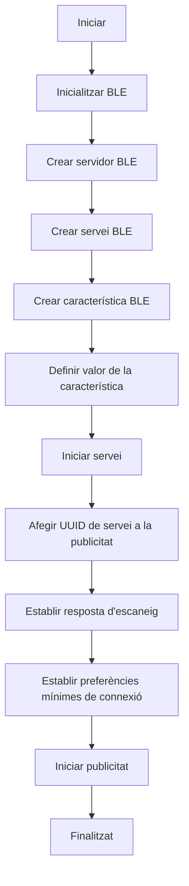

# P3-WIFI-y-Bluetooth_Africa

# BLUETOOTH 
Alumna: **Bernat Rubiol**

## Objectiu
L'objectiu de la pràctica és comprendre el funcionament de WIFI i BT.

Per a això realitzarem una pràctica on generarem un web server des de utilitzant la nostra ESP32 i també una comunicació sèrie amb una aplicació d'un mòbil amb BT.


## Practica B  comunicación bluetooth con el movil 

### Codi

```cpp
  #include "BluetoothSerial.h"

  #if !defined(CONFIG_BT_ENABLED) || !defined(CONFIG_BLUEDROID_ENABLED)
  #error Bluetooth is not enabled! Please run `make menuconfig` to and enable it
  #endif

  BluetoothSerial SerialBT;

  void setup() {
    Serial.begin(115200);
    SerialBT.begin("ESP32test"); //Bluetooth device name
    Serial.println("The device started, now you can pair it with bluetooth!");
  }

  void loop() {
    if (Serial.available()) {
      SerialBT.write(Serial.read());
    }
    if (SerialBT.available()) {
      Serial.write(SerialBT.read());
    }
    delay(20);
  }
```

Utilizar  la siguiente aplicación para realizar la comunicación serie 


### informe
Realitzat l'informe de funcionament així com les sortides que s'obtenen a través de la impressió sèrie

El codi que se'ns proporciona estableix una comunicació Bluetooth entre un dispositiu ESP32 i un altre dispositiu Bluetooth (en el nostre cas fem servir el telèfon per connectar-nos a la placa).

Velocitat de la comunicació sèrie -> 115200 bauds.

S'inicia la comunicació Bluetooth amb el nom 'ESP32test'

S'imprimeix un missatge al Terminal sèrie que diu:

       "The device started, now you can pair it with bluetooth!"

Indicant que el dispositiu ha començat i està llest per aparellar-se a través de Bluetooth. 

Quan entrem a l'aplicació mobil que ens acabem de descarregar podrem xatejar i enviar missatges entre la ESP i el nostre dispositiu


## Ejercicios de mejora de nota : Servidor ESP32 BLE

2. BLE ( bluetooth low energy) revisar e implementar el código del siguiente tutorial 
     https://randomnerdtutorials.com/esp32-bluetooth-low-energy-ble-arduino-ide/


### Codi
```cpp

#include <BLEDevice.h>
#include <BLEUtils.h>
#include <BLEServer.h>


#define SERVICE_UUID        "4fafc201-1fb5-459e-8fcc-c5c9c331914b"
#define CHARACTERISTIC_UUID "beb5483e-36e1-4688-b7f5-ea07361b26a8"

void setup() {
  Serial.begin(115200);
  Serial.println("Starting BLE work!");

  BLEDevice::init("AfricaBernat");
  BLEServer *pServer = BLEDevice::createServer();
  BLEService *pService = pServer->createService(SERVICE_UUID);
  BLECharacteristic *pCharacteristic = pService->createCharacteristic(
    CHARACTERISTIC_UUID,
    BLECharacteristic::PROPERTY_READ |
    BLECharacteristic::PROPERTY_WRITE
  );

  pCharacteristic->setValue("Hello World says Africa&Bernat");
  pService->start();
  // BLEAdvertising *pAdvertising = pServer->getAdvertising();  // this still is working for backward compatibility
  BLEAdvertising *pAdvertising = BLEDevice::getAdvertising();
  pAdvertising->addServiceUUID(SERVICE_UUID);
  pAdvertising->setScanResponse(true);
  pAdvertising->setMinPreferred(0x06);  // functions that help with iPhone connections issue
  pAdvertising->setMinPreferred(0x12);
  BLEDevice::startAdvertising();
  Serial.println("Characteristic defined! Now you can read it in your phone!");
}

void loop() {
  // put your main code here, to run repeatedly:
  delay(2000);
}
```

## Diagrama de flux




## Explicació de funcionament del codi que porporcionem

Seguint el diagrama de 

Creem el nostre dispositiu BLE anomenat 'AfricaBernat' ('BLEDevice::init("AfricaBernat");').

Configurem el dispositiu BLE com a servidor ('BLEServer *pServer = BLEDevice::createServer();').

A l'expressió 'BLEService *pService = pServer->createService(SERVICE_UUID);'creem un servei per al servidor BLE amb el UUID que ja hem definit (UUID = "4fafc201-1fb5-459e-8fcc-c5c9c331914b").

Creem una característica dins del servidor amb un UUID específic i propietats de lectura i escriptura.

Establim un valor per a la característica:

     Hello World says Africa&Bernat.

Al bucle principal 'loop()' s'insereix una pausa de dos segons entre interaccions.

Durant l'execució del codi, s'imprimeixen missatges de depuració al port sèrie. Els missatges impresos inclouen informació sobre l'inici del treball BLE i la definició de la característica, així com una indicació que la característica està a punt per ser llegida des d'un dispositiu mòbil.

La sortida de la impressió sèrie proporciona informació sobre l'estat i la configuració del dispositiu BLE. Els missatges de depuració inclouen
    
     Starting BLE work!
     Characteristic defineix! Now you can read it in your phone!

Quan el dispositiu ESP32 està en funcionament i anunciant el seu servei BLE, altres dispositius (per exemple: telèfons mòbils) poden detectar-lo i connectar-s'hi.

La característica definida al servei pot ser llegida i escrita per altres dispositius BLE connectats.


    