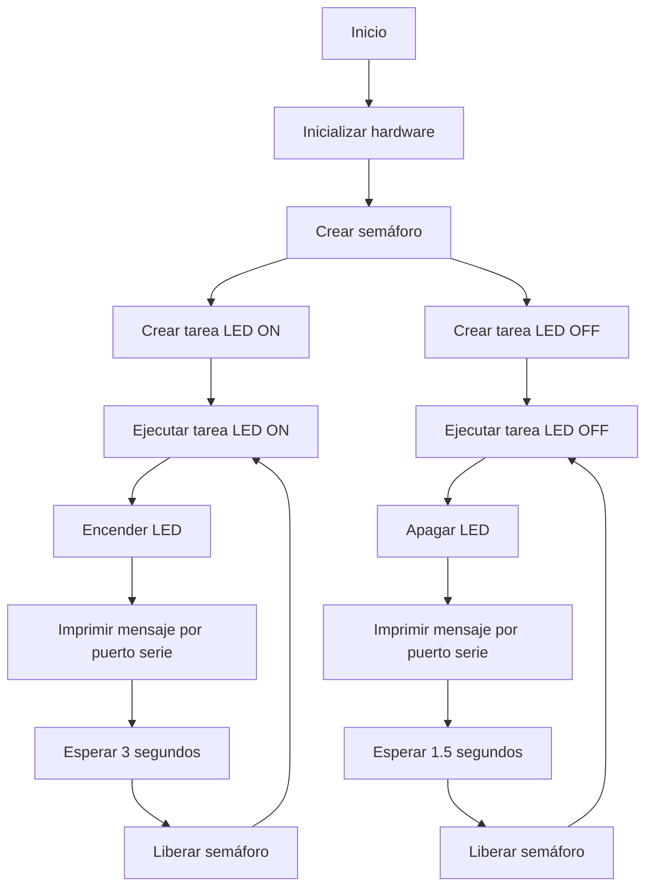

# PRACTICA 4 :  RTOS Semàfor  
**Alumne: Bernat Rubiol**

## EXERCICI PRÀCTIC 2: Semafor
Realitzar un programa que utilitzi dues tasques una encén un led i una altra ho apaga aquestes tasques han d'estar sincronitzades

**1. Sortida pel port sèrie**

Pel port sèrie es mostra quina tasca corre a cada moment.
En cas que estigui corrent la tasca 'led ON' pel port sèrie es mostrarà:

>Executant tasca: LED ON

Si en canvi esteu corrent la tasca 'led OFF', apareixerà pel port sèrie:

>Executant tasca: LED OFF

Aquests missatges s'imprimeixen al monitor serial cada vegada que s'executa la tasca respectiva.

**2. Funcionament**
A la funció 'void setup()' s'inicia la comunicació a una velocitat de 112500 bauds, es configura el pin LED com a sortida i es crea el semàfor utilitzant 'xSemaphoreCreateMutex()'.

 xTaskCreate(ledON, "LED ON", 10000, NULL, 1, NULL);
 xTaskCreate(ledOFF, "LED OFF", 10000, NULL, 1, NULL);

Aquí estem creant dues tasques, una per encendre el LED i una altra per apagar-lo (ambdues tasques amb prioritat 1).

El bucle principal 'void loop()' està buit, ja que tota la feina es realitza en les tasques creades.

**Tasca per encendre el LED: 'ledON()'**

    void ledON (void * pvParameters){
        for(;;){
            xSemaphoreTake(semafor, portMAX_DELAY);
            digitalWrite(LED, HIGH);
            Serial.println("Ejecutando tarea: LED ON");
            delay(3000);
            xSemaphoreGive(semafor);
        }
    }

Per encendre el LED uso un bucle infinit 'for(;;)' que s'executa constantment fins que el programa s'atura. Dins d'aquest bucle el programa s'assegura que ningú més no està utilitzant el LED en aquest moment (mitjançant l'ús del semàfor) i un cop assegurat, encén el LED i imprimeix un missatge pel port sèrie per informar que està encenent. Després d'esperar 3 segons (temps que he posat al delay però és modificable), allibera el semàfor per permetre que altres parts del programa accedeixin al LED si cal.

**Tasca per apagar el LED: 'ledOFF()'**

    void ledOFF (void * pvParameters){
        for(;;){
            xSemaphoreTake(semafor, portMAX_DELAY);
            digitalWrite(LED, LOW);
            Serial.println("Ejecutando tarea: LED OFF");
            delay(1500);
            xSemaphoreGive(semafor);
        }
    }

Per apagar el LED, utilitzo un bucle infinit (for(;;)) que s'executa constantment mentre el programa està en execució. Per apagar el LED, utilitzo un bucle infinit (for(;;)) que s'executa constantment mentre el programa està en execució. Dins aquest bucle, el programa s'assegura que ningú més estigui utilitzant el LED simultàniament. Un cop assegurat, apaga el LED i després imprimeix un missatge pel port sèrie per informar que està apagat. Després d'esperar 1.5 segons (el temps definit al 'delay()' però que pot ser modificat), allibera el semàfor per permetre que altres parts del programa accedeixin al LED si cal.

**3. Diagrama de flujo**

**Conclusió**
En aquesta pràctica he après com controlar un LED utilitzant un microcontrolador (ESP32) amb múltiples tasques mitjançant semàfors. He après a fer que l'ESP32 faci diverses coses alhora, com ara encendre i apagar el LED, sense que una tasca interfereixi amb l'altra. També he après com evitar que dues tasques intentin utilitzar el LED al mateix temps, cosa que podria causar problemes.

He utilitzat la comunicació serial per imprimir missatges, ja que personalment m'han ajudat a entendre què estava fent el programa a cada moment ia solucionar problemes més fàcilment.