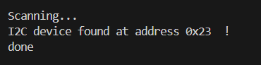
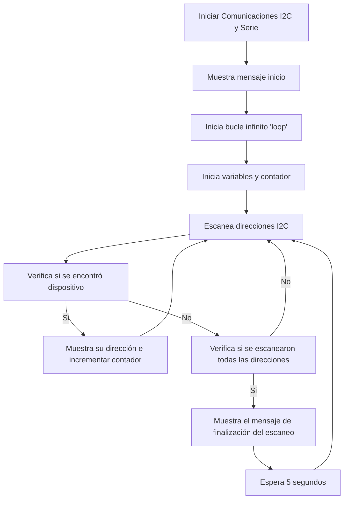

# PRACTICA 5 :  I2C
Alumne: **Bernat Rubiol**

L'objectiu de la pràctica és comprendre el funcionament dels busos
 sistemes de comunicació entre perifèrics; aquests elements poden
 ser interns o externs al processador.

Aquesta és la primera pràctica on es veuran els busos i2c, spi,
 i2s , usart.


## Exercici Pràctic 1: ESCÀNER I2C

Programar el codi següent, col·locar diversos dispositius I2C


Les resistències de pull-up depenen del nombre de dispositius ;
encara que un valor usual és 3k3


```cpp
#include <Arduino.h>

#include <Wire.h>


void setup()
{
  Wire.begin();
  Serial.begin(115200);
  while (!Serial);             // Leonardo: wait for serial monitor
  Serial.println("\nI2C Scanner");
}
 
 
void loop()
{
  byte error, address;
  int nDevices;
 
  Serial.println("Scanning...");
 
  nDevices = 0;
  for(address = 1; address < 127; address++ )
  {
    // The i2c_scanner uses the return value of
    // the Write.endTransmisstion to see if
    // a device did acknowledge to the address.
    Wire.beginTransmission(address);
    error = Wire.endTransmission();
 
    if (error == 0)
    {
      Serial.print("I2C device found at address 0x");
      if (address<16)
        Serial.print("0");
      Serial.print(address,HEX);
      Serial.println("  !");
 
      nDevices++;
    }
    else if (error==4)
    {
      Serial.print("Unknown error at address 0x");
      if (address<16)
        Serial.print("0");
      Serial.println(address,HEX);
    }    
  }
  if (nDevices == 0)
    Serial.println("No I2C devices found\n");
  else
    Serial.println("done\n");
 
  delay(5000);           // wait 5 seconds for next scan
}
```
### 1. Descebre la sortida pel port sèrie

El programa comença imprimint pel port sèrie un missatge que indica que s'està fent un escaneig I2C.

 Scanning...

Mentre duri l'escaneig, el programa imprimeix un missatge que indica a quina adreça específica en cas que es troba el dispositiu 'I2C'.

 I2C device found at adress 0xXX!
 Done

Si el dispositiu no es troba a l'adreça específica, el programa imprimeix pel port sèrie:

 Unknown error at adress OxXX.
 No I2C devices found


Captura de pantalla feta per nosaltres:




### 2. Explicar el funcionament

Escàner I2C per a dispositius connectats a un bus I2C en un microcontrolador.

El programa comença inicialitzant la comunicació I2C i el port sèrie.

Quan s'inicialitzen les comunicacions I2C i sèrie a la funció **setup()**, el programa entra al bucle infinit **loop()**. Dins aquest bucle, es fa l'escaneig continu d'adreces I2C.

 *1. Escaneig d'adreces I2C*

S'inicialitza una variable 'adress' per emmagatzemar les adreces I2C que s'escanejaran (començant des d'1 fins a 127).

Amb el bucle 'for' es recorren totes les adreces possibles.

Dins del bucle, s'intenta iniciar una transmissió cap a la direcció actual del dispositiu utilitzant **Wire.beginTransmission(address)**.

Amb **Wire.endTransmission()** el programa verifica si hi ha cap error a la transmissió.

 - Si no hi ha cap error (error == 0), vol dir que un dispositiu va respondre a l'adreça actual i s'incrementa el comptador **nDevices**.

 - Si es detecta un error (error == 4), s'imprimeix un missatge indicant que va passar un error desconegut en aquesta adreça.

Per a cada dispositiu trobat, se n'imprimeix l'adreça al monitor serial (això es pot veure a la captura adjuntada al primer apartat).

 *2. Resultats de l'escaneig*

Quan totes les adreces s'han escanejat, es comprovarà si hi ha dispositius ('nDevices != 0'). Si no s'han trobat dispositius, s'imprimeix un missatge indicant que no s'han trobat dispositius I2C.

Per contra, el port sèrie imprimeix un missatge indicant que es va completar l'escaneig.

 *3. Espera entre escanejats*

Un cop completat l'escaneig de totes les adreces, el programa espera 5 segons utilitzant 'delay(5000)' abans de començar amb el proper escaneig. Això assegura que l'escaneig es faci a intervals regulars.

## 

### Diagrama de flux

