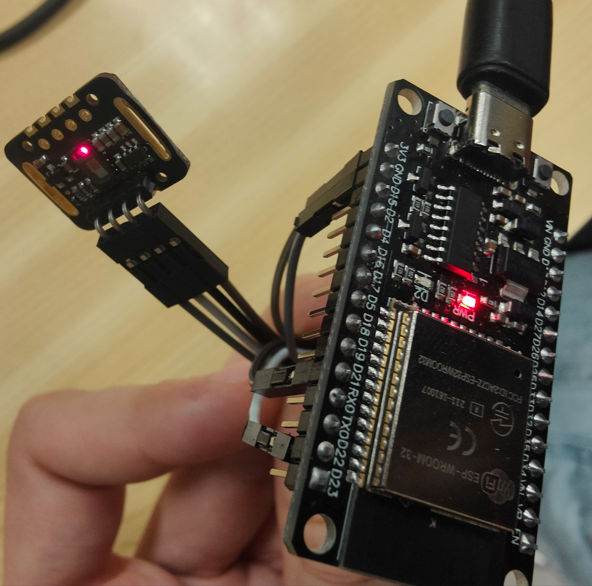
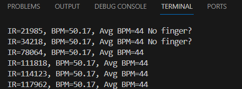

# PRACTICA 5 :  I2C
Alumne: **Bernat Rubiol**

## Exercici Pràctic 2

1. Realitzar un programa que utilitzi un dispositiu i2c com ara algun dels següents

 1. Foto del muntatge
 

 Explicació del muntatge:
 | MAX30105 | ESP32 |Color cable|
|----------|-------|-----|
| VIN | 3V3 | marró|
| SDA | D21 | negre|
| SCL | D22 | blanc|
| GND | GND | gris|

 2. sortides de depuració ( print...)

 

 3. explicació del codi

 ### Inicialització i configuració:
S'inicia la comunicació serial a una velocitat de 115.200 bauds per a la sortida de dades.
S'inicialitza el sensor MAX30105. Si no es troba el sensor, s'imprimeix un missatge d'error i el programa entra en un bucle infinit.
Es configura el sensor amb la funció setup(), utilitzant els paràmetres predeterminats.
L'amplitud del pols vermell s'ajusta a un valor de 0x0A i s'apaga el LED verd.

 ### Bucle principal (loop()):
Es llegeix el valor de la llum infraroja (IR) provinent del sensor mitjançant la funció particleSensor.getIR().
Es verifica si es va detectar un batec cardíac utilitzant la funció checkForBeat(). Si es detecta un batec, es calcula la freqüència cardíaca en pulsacions per minut (BPM).
Si la freqüència cardíaca calculada és vàlida (entre 20 i 255 BPM), s'emmagatzema en un arranjament rates[] per fer una mitjana posteriorment.
Es calcula la mitjana de les freqüències cardíaques emmagatzemades a l'arranjament rates[].
Els valors d'IR, BPM i BPM mitjana s'imprimeixen mitjançant la comunicació serial.
Es verifica si hi ha un dit col·locat al sensor basant-se en el valor d'IR. Si el valor d'IR és inferior a 50.000, s'imprimeix un missatge indicant que no s'ha detectat cap dit.