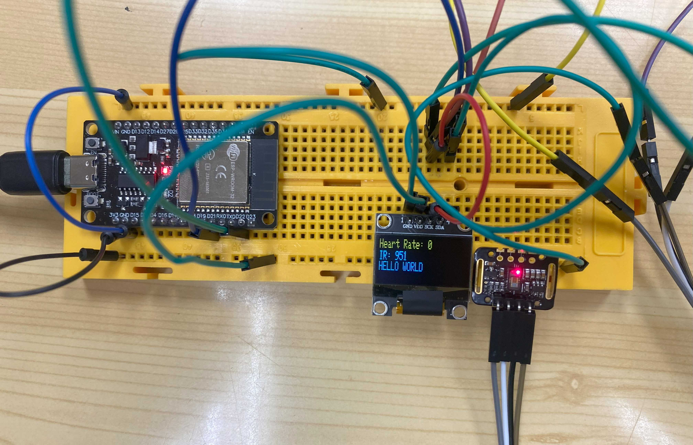

# PRACTICA 5 :  I2C
Alumne: **Bernat Rubiol**

## Exercici de pujada de nota (molt valorat)

* Part 1.- Realitzar utilitzant el display i el sensor anterior un dispositiu que mostri en display la freqüència cardíaca i el contingut d'oxigen.




## Explicació del codi

>Es pot trobar sencer a `/scr`

1. Inicialització:
- Es configuren les comunicacions i s'inicialitzen el sensor i la pantalla OLED.
- Es mostra un missatge dinici a la pantalla.

2. Bucle principal (`loop()`):
- S'obté la lectura del sensor de pols.

>long irValue = particleSensor.getIR();

- Es verifica si hi ha un batec cardíac.

>if (checkForBeat(irValue) == true) {

- Es calcula la freqüència cardíaca i s'actualitza la mitjana de les freqüències cardíaques.
```cpp
long delta = millis() - lastBeat;
lastBeat = millis();

beatsPerMinute = 60 / (delta / 1000.0);

if (beatsPerMinute < 255 && beatsPerMinute > 20) {
rates[rateSpot++] = (byte)beatsPerMinute;
rateSpot %= RATE_SIZE;

beatAvg = 0;
for (byte x = 0; x < RATE_SIZE; x++)
        beatAvg += rates[x];
beatAvg /= RATE_SIZE;
}
```
- Es mostra la freqüència cardíaca i el valor del sensor IR a la pantalla OLED.

```cpp
display.clearDisplay();
display.setTextSize(1);
display.setTextColor(SSD1306_WHITE);
display.setCursor(0, 0);
display.print("Heart Rate: ");
display.println(beatAvg);
display.print("IR: ");
display.println(irValue);
display.display();
```

- S'espera un segon abans de la propera lectura.

```cpp
delay(1000); // Update every second
```