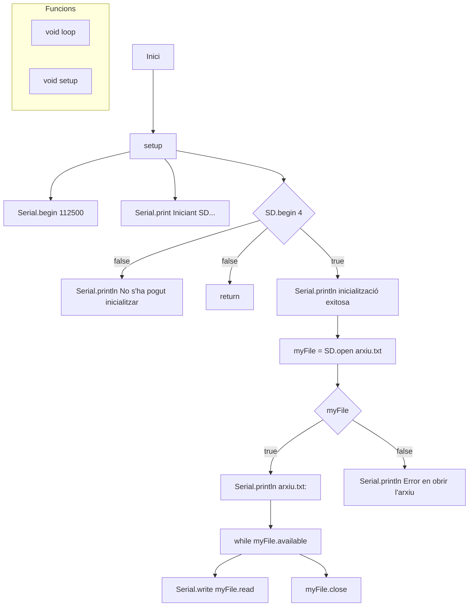

# PRÀCTICA 6 - SPI  
Alumne : **Bernat Rubiol**

## Exercici Pràctic 1 LECTURA/ESCRIPTURA DE MEMÒRIA SD

1. Descebre la sortida pel port sèrie

Pel port sèrie sortirà primer :
 Iniciant SD ...

Per indicar que el procés d'inicialització de la targeta SD està en curs.

Si la inicialització de la targeta SD ha estat exitosa, s'imprimeix:

 Inicialització amb èxit.

En cas contrari:

 No s'ha pogut inicialitzar.

Si la targeta SD s'inicialitza correctament i el fitxer "arxiu.txt" s'obre sense problemes, el programa imprimirà el contingut del fitxer línia per línia a través del port sèrie a una velocitat de 112500 bauds. Cada línia del fitxer s'imprimeix al port sèrie fins que s'ha llegit tot el contingut del fitxer.

Si hi hagués algun error per obrir el fitxer sortiria:

 Error en obrir el fitxer.

-----
2. Explicar el funcionament

El codi és un programa que utilitza una targeta SD per llegir un fitxer anomenat "arxiu.txt" i mostrar-ne el contingut a través del port sèrie.

1. Inclusió de biblioteques: Al principi del codi, s'hi inclouen les biblioteques `SPI.h` i `SD.h`. Aquestes biblioteques són necessàries per a la comunicació amb la targeta SD a través del bus SPI (Serial Peripheral Interface).

2. Declaració de variables globals: Es declara una variable global `myFile` del tipus File. Aquesta variable s'utilitzarà per interactuar amb el fitxer a la targeta SD.

3. Funció `setup()`:
S'inicialitza la comunicació serial a una velocitat de 112500 bauds mitjançant `Serial.begin(112500)`.
S'imprimeix "Iniciant SD..." al port sèrie per indicar que el procés d'inicialització de la targeta SD està en curs.
S'intenta inicialitzar la targeta SD utilitzant `SD.begin(4)`, on l'argument 4 representa el pin CS (Chip Select) de la targeta SD.
Si la inicialització de la targeta SD és exitosa, s'imprimeix "inicialització reeixida" al port sèrie. En cas contrari, s'imprimeix "No s'ha pogut inicialitzar" i la funció `setup()` acaba.
Si la inicialització de la targeta SD és exitosa, s'intenta obrir el fitxer "arxiu.txt" en mode lectura `(SD.open("arxiu.txt"))`. Si el fitxer s'obre correctament, s'imprimeix "arxiu.txt:" al port sèrie.
Llegiu i imprimiu el contingut del fitxer línia per línia fins que no s'hagi llegit tot el contingut.
Finalment, el fitxer es tanca amb `myFile.close()`.
4. Funció `loop()`: Aquesta funció s'executa contínuament després que `setup()` s'ha acabat. No obstant això, en aquest programa, la funció `loop()` és buida, per la qual cosa no realitza cap tasca específica.

### Diagrama de flux

