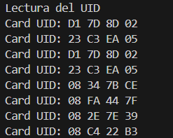
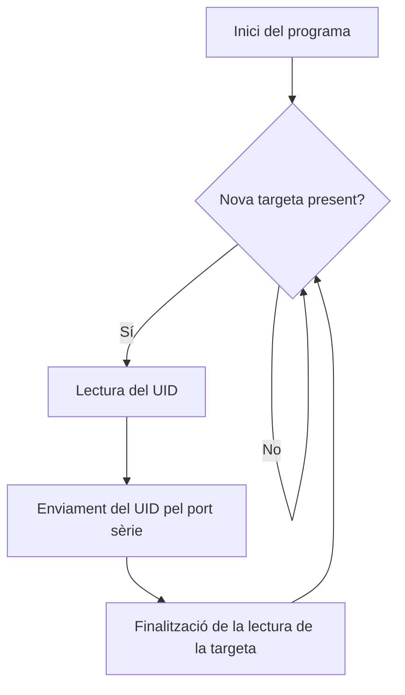
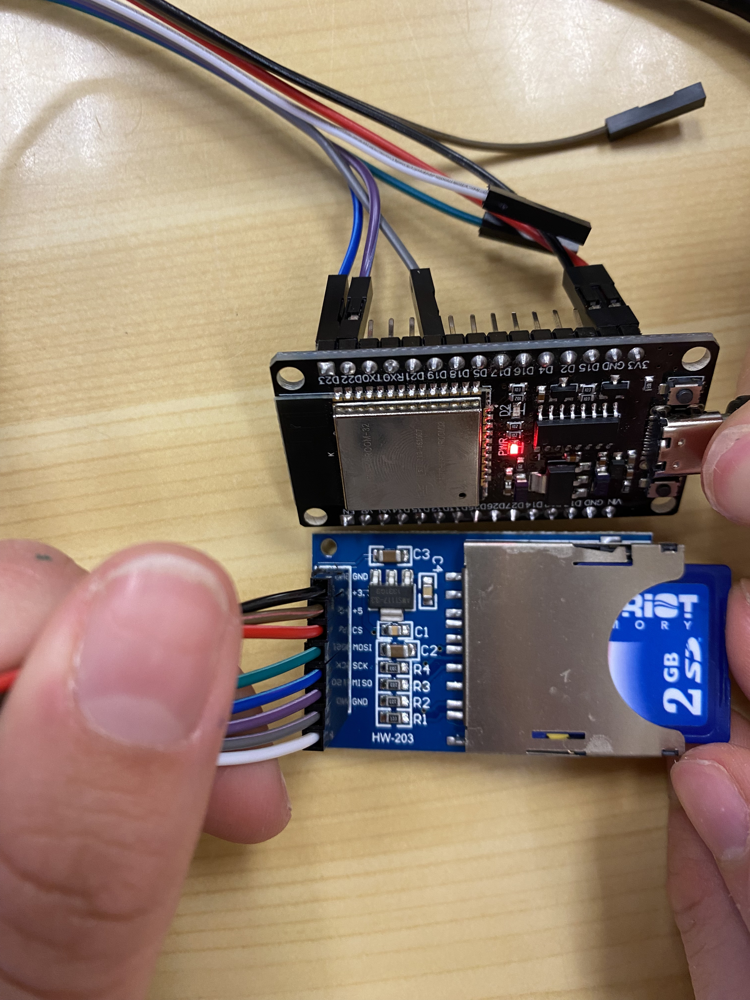
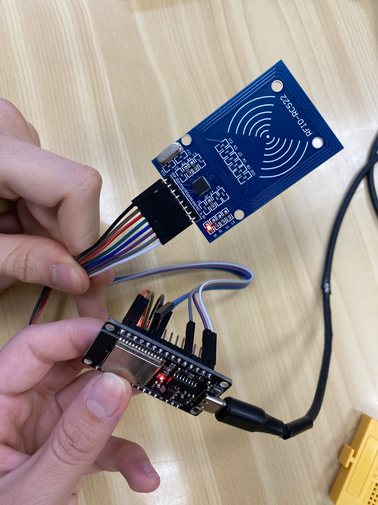

# PRACTICA 6 - SPI  
Alumne: **Bernat Rubiol**


## Exercici Pràctic 2 LECTURA D'ETIQUETA RFID


| | Pin | Color cable |
|--------|--------|-------------|
| SCK    | 22     | Marro       |
| MISO   | 19     | Verd        |
| MOSI   | 23     | Vermell     |
| SS     | 21     | Negre       |
| RESET  | 4      | Gris        |
| GND    | GND    | Lila        |
| 3V3    | 3V3    | Blanc       |


MOSI (Master Output Slave Input): sortida de dades del Màster i entrada de dades a l'Esclau.

MISSO (Master Input Slave Output): Sortida de dades de l'Esclau i entrada al Màster.


1. Descebre la sortida pel port sèrie



2. Explicar el funcionament



1. Inici del programa:
El programa comença inicialitzant la comunicació serial i el bus SPI necessari per comunicar-se amb el lector RFID MFRC522.

2. Bucle principal:
El programa entra a un bucle infinit on contínuament verifica si hi ha una nova targeta RFID present.

3. Verificació de nova targeta:
Es verifica si hi ha una nova targeta RFID present utilitzant la funció `mfrc522.PICC_IsNewCardPresent()`.

4. Lectura de l'UID:
Si es detecta una nova targeta, es procedeix a llegir el vostre UID utilitzant la funció `mfrc522.PICC_ReadCardSerial()`.

5. Enviament de l'UID pel port sèrie:
Un cop llegit l'UID, s'envia pel port sèrie utilitzant la funció `Serial.print()`. Això permet visualitzar l'UID a la consola serial per a propòsits de depuració i verificació del funcionament.

6. Finalització de la lectura de la targeta:
Després de completar la lectura de l'UID de la targeta, finalitza la lectura de la targeta actual amb la funció `mfrc522.PICC_HaltA()`.

7. Repetició del procés:
Després de completar totes les operacions, el programa torna a iniciar el bucle per repetir el procés i continuar llegint targetes RFID.

3.fotos del muntatge






4. sortides de depuració ( print...)

El codi utilitza la funció `Serial.print()` per mostrar l'UID de la targeta detectada a través del port sèrie. Això permet depurar i verificar el funcionament del programa.

5. codi generat

```cpp
#include <Arduino.h>
#include <SPI.h>
#include <MFRC522.h>

#define RST_PIN	4    //Pin 9 para el reset del RC522
#define SS_PIN	21   //Pin 10 para el SS (SDA) del RC522
//Conectem els pins de mosi i miso
MFRC522 mfrc522(SS_PIN, RST_PIN); //Creamos el objeto para el RC522

void setup() {
	Serial.begin(112500); //Iniciamos la comunicación  serial
	SPI.begin(22,19,23);        //Iniciamos el Bus SPI
	mfrc522.PCD_Init(); // Iniciamos  el MFRC522
	Serial.println("Lectura del UID");
}

void loop() {
// Revisamos si hay nuevas tarjetas  presentes
if ( mfrc522.PICC_IsNewCardPresent()) 
{  
        //Seleccionamos una tarjeta
        if ( mfrc522.PICC_ReadCardSerial()) 
        {
                // Enviamos serialemente su UID
                Serial.print("Card UID:");
                for (byte i = 0; i < mfrc522.uid.size; i++) {
                        Serial.print(mfrc522.uid.uidByte[i] < 0x10 ? " 0" : " ");
                        Serial.print(mfrc522.uid.uidByte[i], HEX);   
                } 
                Serial.println();
                // Terminamos la lectura de la tarjeta  actual
                mfrc522.PICC_HaltA();         
        }      
}	
}
```