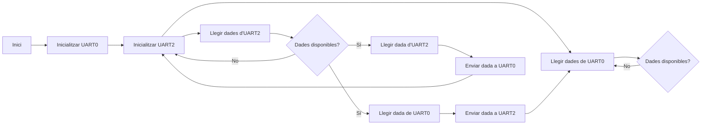
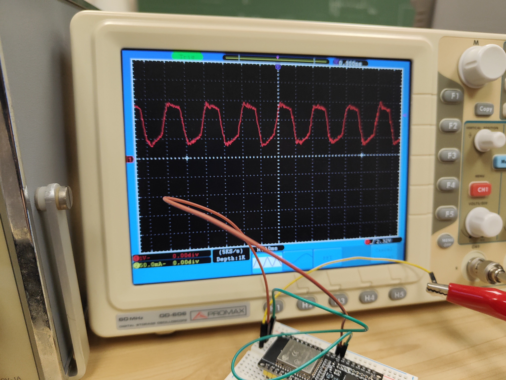

## **PRÀCTICA - 7 UART**

Alumne: **Bernat Rubiol**


**UART* (Universal Asynchronous Receiver/Transmitter): defineix un protocol o un conjunt de normes per a l'intercanvi de dades en sèrie entre dos dispositius. UART utilitza només dos fils entre el transmissor i el receptor per transmetre(Tx) i rebre(Rx) en les dues direccions.


Un dels avantatges més grans d'UART és que és asíncron: el transmissor i el receptor no comparteixen el mateix senyal de rellotge. Com que no comparteixen un rellotge, tots dos extrems han de transmetre a la mateixa velocitat, prèviament concertada, per tal de mantenir la mateixa temporització dels bits.


Les trames UART contenen bits d'inici i aturada, bits de dades i un bit opcional de paritat.

----


## Explicació del codi

En aquesta pràctica hem fet un programa que estableix comunicació bidireccional entre dos ports serials (UART), en el nostre cas entre el monitor i el teclat.

1. Inicialització al `setup()`:

- S'inicialitza la comunicació serial per al port UART0 a una velocitat de 115.200 bauds.

```cpp
Serial.begin(115200);
```
- S'inicialitza la comunicació serial per al port UART2 també a una velocitat de 115.200 bauds, utilitzant 8 bits de dades, sense paritat i 1 bit de parada (configuració `SERIAL_8N1`). S'especifiquen els pins físics en què es connectarà aquesta comunicació serial, en aquest cas, GPIO17 (TX2) i GPIO16 (RX2).

```cpp
Serial2.begin(115200, SERIAL_8N1, 17, 16);
```

2. `loop()`:

Al bucle principal, el programa està constantment revisant si hi ha dades disponibles a UART0 (`Serial.available()`). Si hi ha dades disponibles, es llegeix un caràcter de UART0 utilitzant `Serial.read()` i s'envia aquest caràcter a UART2 utilitzant `Serial2.write(c)`.

Després el programa verifica si hi ha dades disponibles a UART2 (`Serial2.available()`). Si hi ha dades disponibles, es llegeix un caràcter de UART2 usant `Serial2.read()` i s'envia aquest caràcter de tornada a UART0 utilitzant `Serial.write(c)`.


### Diagrama de flux


### Resultat oscil·loscopi




Quan enviem dades des del teclat a través d'UART0 i les mostrem a l'oscil·loscopi, el que veiem depèn de la manera com l'oscil·loscopi interpreti les dades introduïdes.