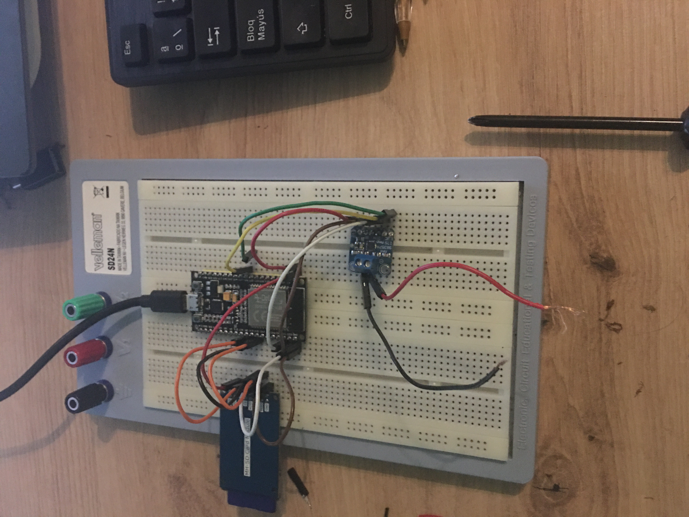

# **PRÁCTICA 7 BUSES DE COMUNICACIÓN I2S**

## **Reproducción desde memoria interna**

Para esta parte de la práctica tuvimos que añadir la librería ESP8266Audio para facilitar tanto la generación del sonido como la comunicación I2S mediante los buses MISO, MOSI, CS, CLK.

Vamos a empezar explicando el código necesario para reproducir un sonido creado por el mismo creador de la librería.

```cs
#include "Arduino.h" 

#include "FS.h"
#include "HTTPClient.h"
#include "SPIFFS.h"
#include "SD.h"
#include "AudioGeneratorAAC.h"
#include "AudioOutputI2S.h"
#include "AudioFileSourcePROGMEM.h"
#include "sampleaac.h"

AudioFileSourcePROGMEM *in;
AudioGeneratorAAC *aac;
AudioOutputI2S *out;
```
Para poder llevar acabo la práctica tenemos que añadir unas librerías las cuáles dependen de otra o de lo contrario nos saldrá error a la hora de compilar.
Las librerías *AudioGeneratorAAC.h,AudioOutput.h,sampleaac.h,AudioFileSourcePROGMEM.h* forman parte de la librería anteriormente mencionada ESP8266Audio. Todas las otras las podemos encontrar en el Framework de Arduino.

Una vez incluidas las librerías declaramos diversos punteros con los cuáles luego vamos a necesitar.

## **Empezemos con el void_setup()**

```cs

void setup(){
  Serial.begin(9600);

  in = new AudioFileSourcePROGMEM(sampleaac, sizeof(sampleaac));
  aac = new AudioGeneratorAAC();
  out = new AudioOutputI2S();
  out -> SetGain(0.125);
  out -> SetPinout(26,25,22);
  aac->begin(in, out);
}
```

Primero inicializamos la comunicación serie.
Declaramos el puntero **in* como una variable que llevará nuestro fichero de audio guardado en el fichero *sampleaac.h*.
El puntero **aac* será el encargado de empezar la comunicación entre el decodificador y nuestra placa.
Finalmente **out* nos servirá para las configuraciones como la ganancia, los pines de salida de la ESP32, forzar una salida mono...
Podemos profundizar en ellas yendo a las declaraciones de cada clase.

### **AudioFileSourcePROGMEM**

```cs

class AudioFileSourcePROGMEM : public AudioFileSource
{
  public:
    AudioFileSourcePROGMEM();
    AudioFileSourcePROGMEM(const void *data, uint32_t len);
    virtual ~AudioFileSourcePROGMEM() override;
    virtual uint32_t read(void *data, uint32_t len) override;
    virtual bool seek(int32_t pos, int dir) override;
    virtual bool close() override;
    virtual bool isOpen() override;
    virtual uint32_t getSize() override;
    virtual uint32_t getPos() override { if (!opened) return 0; else return filePointer; };

    bool open(const void *data, uint32_t len);

  private:
    bool opened;
    const void *progmemData;
    uint32_t progmemLen;
    uint32_t filePointer;
};
```
Así por encima vemos que es una clase que no tiene mucha complejidad.
La función *AudioFileSourcePROGMEM()* de lo que se encarga esta es guardar en un puntero cierta información (lo que se le envía por el primer parámetro) y en el segundo parámetro tiene la longitud de ese puntero.
Si vamos a la descripción de esta función encontramos:
```cs
AudioFileSourcePROGMEM::AudioFileSourcePROGMEM(const void *data, uint32_t len)
{
  open(data, len);
}
```
Donde la función open hace una tarea muy básica, si alguno de los dos parámetros que le hemos pasado está vacío nos retorna *false*. Si no están vacíos, le da un valor a alguna variable de la clase.

Todo lo demás son funciones que a priori no necesitamos para lo que queremos hacer.  
  

### **Audio Generator AAC**
```cs

class AudioGeneratorAAC : public AudioGenerator
{
  public:
    AudioGeneratorAAC();
    AudioGeneratorAAC(void *preallocateData, int preallocateSize);
    virtual ~AudioGeneratorAAC() override;
    virtual bool begin(AudioFileSource *source, AudioOutput *output) override;
    virtual bool loop() override;
    virtual bool stop() override;
    virtual bool isRunning() override;

  protected:
    void *preallocateSpace;
    int preallocateSize;

    // Helix AAC decoder
    HAACDecoder hAACDecoder;

    // Input buffering
    const int buffLen = 1600;
    uint8_t *buff; //[1600]; // File buffer required to store at least a whole compressed frame
    int16_t buffValid;
    int16_t lastFrameEnd;
    bool FillBufferWithValidFrame(); // Read until we get a valid syncword and min(feof, 2048) butes in the buffer

    // Output buffering
    int16_t *outSample; //[1024 * 2]; // Interleaved L/R
    int16_t validSamples;
    int16_t curSample;

    // Each frame may change this if they're very strange, I guess
    unsigned int lastRate;
    int lastChannels;

};


```
Esta clase tiene parámetros que cabe explicarlos un poco por encima para entender el funcionamiento de esta.

La primero que nosotros hemos usado es el constructor que nos establece las variable como *default*.

En esta clase vamos a guardar parámetros importantes como el tamaño del buffer de entrada y de salida, la posición por la que vamos, el rate... En definitiva aunque suene muy complejo todo esto, son parámetros que necesitamos para poder enviar los datos por el bus I2S.

También usamos las funciones begin que es la que realmente una vez configurados todos los parámetros y nombradas todas las variables, es la que nos permite empezar a usar esta comunicación. Hace alguna comprovación si lo que le llega no está vacío y luego con el puntero *this* apunta al parámetro output enviado y este a una función *begin()* definida en la clase *AudioOutput*.
Luego establece el número de bits por muestra, en este caso 16, ya que usamos 16 bits para esta placa y establece la variable *running=true*.

### **AudioOutputI2S** ###
Esta básicamente nos sirve para elegir los puertos de salida y alguna configuración como la ganancia.

```cs
AudioOutputI2S::AudioOutputI2S(int port, int output_mode, int dma_buf_count, int use_apll)
{
  this->portNo = port;
  this->i2sOn = false;
  this->dma_buf_count = dma_buf_count;
  if (output_mode != EXTERNAL_I2S && output_mode != INTERNAL_DAC && output_mode != INTERNAL_PDM) {
    output_mode = EXTERNAL_I2S;
  }

```

## **Finalmente void_loop()...**
```cs
void loop(){
  if (aac->isRunning()) {
    Serial.printf("Sound Generator\n");
    aac->loop();
  } else {
    aac -> stop();
    delay(1000);
  }
}
```
Es muy simple el funcionamiento del void loop, simplemente usando tres funciones de la clase *Audio Generator AAC* conseguiremos reproducir el sonido que queramos.
Lo primero que hace es mirar si la variable Running está en true porque es la manera de que el programa sabe que no hay ningún error y le hemos pasado el fichero de audio correctamente como antes he mencionado.
Una vez se le devuelve *true* llama a la función loop().

### **bool AudioGeneratorAAC::loop()** ###
```cs 
bool AudioGeneratorAAC::loop()
{
  if (!running) goto done; // Nothing to do here!

  // If we've got data, try and pump it out...
  while (validSamples) {
    if (lastChannels == 1) {
       lastSample[0] = outSample[curSample];
       lastSample[1] = outSample[curSample];
    } else {
      lastSample[0] = outSample[curSample*2];
      lastSample[1] = outSample[curSample*2 + 1];
    }
    if (!output->ConsumeSample(lastSample)) goto done; // Can't send, but no error detected
    validSamples--;
    curSample++;
  }
```
Solamente recorre todas las muestras mediante el bucle while() y va variando el valor de la muestra de salida.

Finalmente si la variable running retorna *false* simplemente llamará la función stop() y esta cerrará el fichero.

# **CONCLUSIONES** #  
Para la realización de esta práctica tuve algún problema con los include sobretodo ya que al compilar me decía que faltaban muchas librerías para incluir y hasta que finalmente entendí el porque me las pedía estuve un buen rato, me di cuenta que esas librerías hacían falta porque eran dependencias de la otra que había añadido.
  
  También tuve que cambiar algún parámetro de la librería ya que por defecto usaba unos pines de salida que no eran los que a mi me interesaban, cabe decir que fue una buena práctica para entender el uso de librerías.  

  Otro problema que me encontré fue el del altavoz, ya que a priori no disponía de niguno por casa por lo que sabía que el programa funcionaba pero podía escuchar el sonido. Finalmente saqué un tweeter de una torre de altavoz que tenía en casa. Con lo que me queda una pregunta para solucionar, soldé el positivo y negativo del altavoz con un cable y lo conecté al decodificador pero me encontré que había muchísimo ruidp, tanto que no podía apenas escuchar el sonido que me interesaba, la pregunta a solucionar es: 
  Fue por el altavoz, por el cableado o el amplificador estaba defectuoso.


