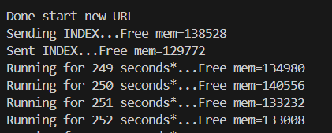
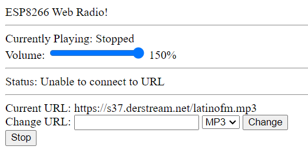

## **PRÀCTICA - 7 Webradio**
Alumne: **Bernat Rubiol**

## Exercici Practico 2 reproduir un arxiu WAVE a ESP32 des d'una targeta SD externa

Volem reproduir el fitxer WAVE que vaig esmentar al principi d'aquest tutorial a través de l'ESP32 NodeMCU i l'altaveu. Com que l'ESP32 ha de llegir el fitxer WAVE i reenviar el senyal d'àudio digital al MAX98357A, hem d'usar una targeta SD amb el fitxer WAVE. També podeu utilitzar un fitxer MP3 en lloc del fitxer WAVE.

La imatge següent mostra el cablejat de l'ESP32 NodeMCU amb el mòdul de targeta (Micro) SD, el MAX98357A i l'altaveu.


1. Descebre la sortida pel port sèrie




2. Explicar el funcionament

-**Inclusió de llibreries**

```cpp
#include <Arduino.h>
#include <WiFi.h> //gestió de la connexió

//llibreries relacionades amb la reproducció d'àudio. Proporcionen funcionalitats per llegir i descodificar fitxers d'àudio en formats específics (MP3 i AAC) i per enviar l'àudio descodificat a través d'una sortida d'àudio (I2S).
#include "AudioFileSourceICYStream.h"
#include "AudioFileSourceBuffer.h"
#include "AudioGeneratorMP3.h"
#include "AudioGeneratorAAC.h"
#include "AudioOutputI2S.h"


#include <EEPROM.h> // proporciona funcions per llegir i escriure a la memòria EEPROM de l'ESP32.

#include "web.h" //proporciona funcionalitats per crear un servidor web i manejar sol·licituds HTTP entrants. 
```
-**Definicions i variables globals**

-**Funcions de gestió de sol·licituds HTTP**: es defineixen funcions per manejar diferents tipus de sol·licituds HTTP, com obtenir l'estat (`HandleStatus`), el títol de la cançó (`HandleTitle`), canviar la URL de la ràdio (`HandleChangeURL`), etc.

- **`setup`**: configura la connexió WiFi, inicia el servidor web i inicialitza variables.

- **`loop`**: s'executa repetidament, manejant sol·licituds HTTP entrants i controlant la reproducció d'àudio.


- **Funcions de control de reproducció d'àudio**:

 `StartNewURL`: inicia nova URL de ràdio.

 `StopPlaying`: atura la reproducció.

 `PumpDecoder`: bomba dades en descodificar l'àudio.


- **Funcions de gestió de configuració `loadSettings()` , `saveSettings()`**: carreguen i guarden la configuració de la ràdio (URL, tipus d'àudio, volum) a l'EEPROM de l'ESP32, cosa que permet que la ràdio recordeu la configuració fins i tot després de reiniciar.

- **Manejo de sol·licituds HTTP al bucle principal `loop()`**: , el programa maneja les sol·licituds HTTP entrants i crida a les funcions corresponents per respondre-hi.

3. Muntatge


4. Web



Des del web es pot controlar la reproducció de ràdio per Internet, canviar d'estació, ajustar-ne el volum i obtenir informació sobre la cançó actual.